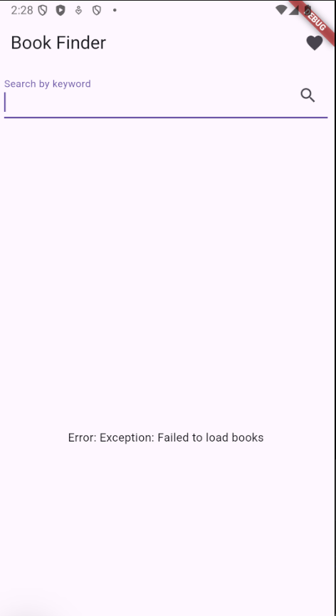
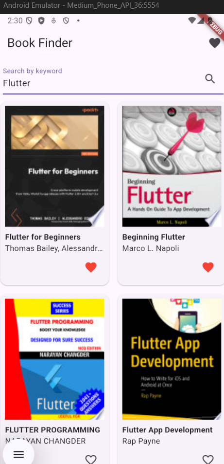
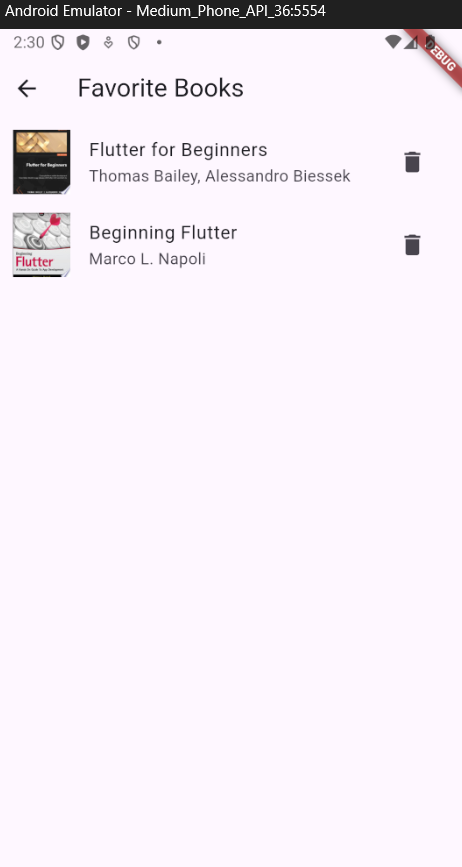

# Book Manager App

## Description

A simple Flutter application for searching books using the Google Books API, saving favorite books locally using SQLite, and viewing/managing the list of favorites.

## Features

- Search for books by keyword using the Google Books API.
- View book details including title, author, and cover image.
- Add/remove books to a local favorites list.
- View the list of favorite books.
- Delete books from the favorites list.

## Setup

To run this project locally, follow these steps:

1.  **Clone the repository:**

    ```bash
    git clone https://github.com/Ouma49/APP_Books_Manager_flutter.git
    cd books_manager
    ```

2.  **Install dependencies:**

    Navigate to the project root in your terminal and run:

    ```bash
    flutter pub get
    ```

    The necessary packages (`http`, `sqflite`, `path`) should be automatically added if you haven't already added them manually.

3.  **Run the application:**

    Make sure you have a Flutter-compatible device or emulator connected and running. You can list connected devices using `flutter devices`.

    To launch the app on a specific device (replace `<device_id>` with your emulator or device ID):

    ```bash
    flutter run -d <device_id>
    ```

    If you don't have an emulator running, you can list available emulators with `flutter emulators` and launch one with `flutter emulators --launch <emulator_id>`.

## Usage

Here are some screenshots illustrating the application's usage:



-   **Searching for books:** Enter a keyword in the search bar on the home page and press the search icon or hit enter.



-   **Favoriting/Unfavoriting books:** Tap the heart icon on a book in the search results to add it to or remove it from your favorites.
-   **Viewing favorites:** Tap the favorite icon in the app bar on the home page to navigate to the Favorites screen. From there, you can see your saved books and delete them by tapping the trash icon.



## Project Structure

```
books_manager/
├── lib/
│   ├── models/
│   │   └── book.dart
│   ├── pages/
│   │   ├── detail.page.dart (Optional: for future detailed view)
│   │   ├── favorites.page.dart
│   │   └── home.page.dart
│   ├── services/
│   │   ├── api_service.dart
│   │   └── db_service.dart
│   └── main.dart
├── README.md
└── pubspec.yaml
```

## Dependencies

-   `http`: For making API calls to the Google Books API.
-   `sqflite`: For local database storage of favorite books.
-   `path`: For managing database file paths.

These dependencies are listed in the `pubspec.yaml` file.

## API

This application uses the Google Books API for searching books. The base URL for search is `https://www.googleapis.com/books/v1/volumes?q={keyword}`.

## Report Details

-   **Name:** DAOUDI OUMAYMA
-   **Class/Course:** GLSID 2
-   **Student ID:** [YOUR STUDENT ID]
-   **Date:** [DATE]
