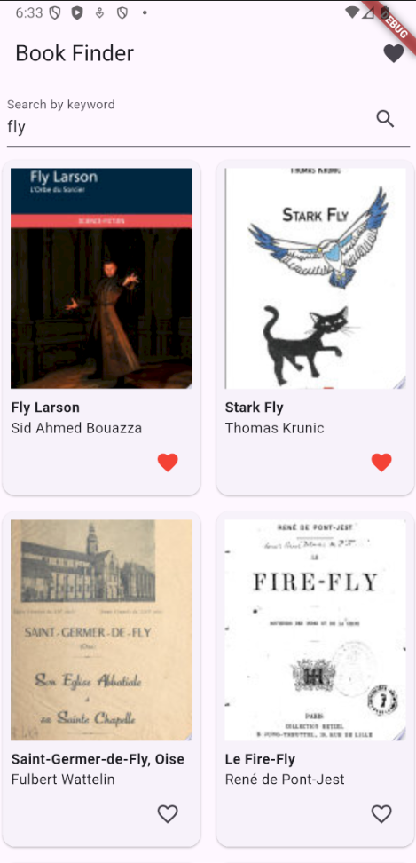
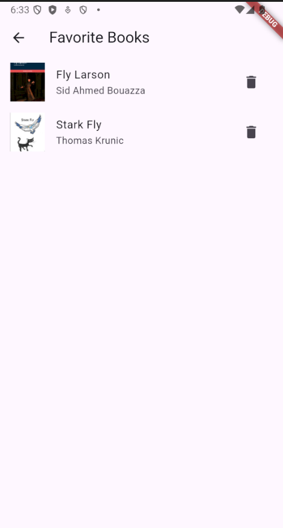

# BookApp - Gestionnaire de Livres avec BLoC

Une application Flutter moderne pour rechercher et gérer vos livres favoris, implémentée avec l'architecture BLoC.

## Fonctionnalités

- 🔍 Recherche de livres via l'API Google Books
- ❤️ Ajout/Suppression de livres aux favoris
- 📚 Vue dédiée pour les livres favoris
- 💾 Persistance des données avec SQLite
- 🎨 Interface utilisateur moderne et intuitive

## Architecture

L'application utilise l'architecture BLoC (Business Logic Component) pour une meilleure séparation des responsabilités :

- **BLoCs** :
  - `BookBloc` : Gestion des livres favoris
  - `SearchBloc` : Gestion de la recherche de livres

- **Services** :
  - `ApiService` : Communication avec l'API Google Books
  - `DatabaseService` : Gestion de la base de données SQLite

- **Modèles** :
  - `Book` : Modèle de données pour les livres

## Prérequis

- Flutter SDK (version 3.7.2 ou supérieure)
- Dart SDK (version 3.0.0 ou supérieure)
- Un IDE (VS Code, Android Studio, ou IntelliJ IDEA)
- Un émulateur ou un appareil physique pour le test

## Installation

1. Clonez le dépôt :

    ```bash
    git clone https://github.com/Ouma49/APP_Books_Manager_flutter_VBLOC.git
    cd books_manager
    ```

2.  **Install dependencies:**

    Navigate to the project root in your terminal and run:

    ```bash
    flutter pub get
    ```

    The necessary packages (`http`, `sqflite`, `path`) should be automatically added if you haven't already added them manually.

3.  **Run the application:**

    Make sure you have a Flutter-compatible device or emulator connected and running. You can list connected devices using `flutter devices`.

    To launch the app on a specific device (replace `<device_id>` with your emulator or device ID):

    ```bash
    flutter run -d <device_id>
    ```

    If you don't have an emulator running, you can list available emulators with `flutter emulators` and launch one with `flutter emulators --launch <emulator_id>`.

## Exécution de l'application

1. Démarrez un émulateur ou connectez un appareil physique

2. Exécutez l'application :

    ```bash
    flutter run
    ```

## Structure du Projet

```
books_manager/
├── lib/
│   ├── blocs/
│   │   ├── book_bloc/
│   │   │   ├── book_bloc.dart
│   │   │   ├── book_event.dart
│   │   │   └── book_state.dart
│   │   └── search_bloc/
│   │       ├── search_bloc.dart
│   │       ├── search_event.dart
│   │       └── search_state.dart
│   ├── models/
│   │   └── book.dart
│   ├── pages/
│   │   ├── home.page.dart
│   │   └── favorites.page.dart
│   ├── services/
│   │   ├── api_service.dart
│   │   └── database_service.dart
│   └── main.dart
├── README.md
└── pubspec.yaml
```

## Utilisation

### Interface Principale


### Gestion des Favoris


1. **Recherche de livres** :
   - Entrez un mot-clé dans la barre de recherche
   - Les résultats s'afficheront dans une grille

2. **Gestion des favoris** :
   - Cliquez sur l'icône de cœur pour ajouter/supprimer un livre des favoris
   - Accédez à la liste des favoris via l'icône dans la barre d'application

## Dépendances Principales

- `flutter_bloc` : ^8.1.4 - Gestion de l'état avec BLoC
- `equatable` : ^2.0.5 - Comparaison d'états
- `sqflite` : ^2.4.2 - Base de données SQLite
- `http` : ^1.4.0 - Requêtes HTTP
- `path` : ^1.9.1 - Gestion des chemins de fichiers

## Tests

L'application inclut des tests unitaires et des tests de widget. Pour exécuter les tests :

```bash
flutter test
```


## Report Details

-   **Name:** DAOUDI OUMAYMA
-   **Class/Course:**  Mobile / GLSID 2

